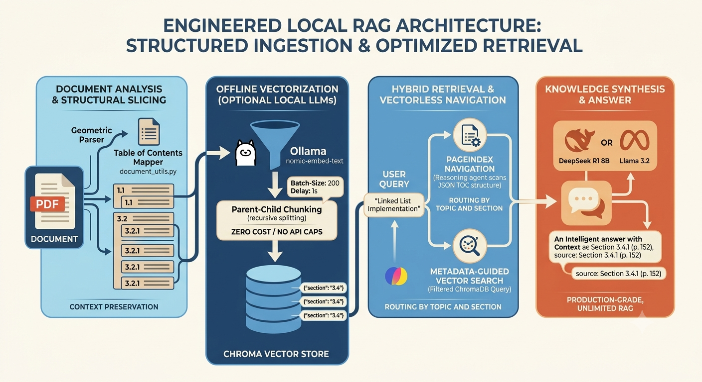

# RAG for DSA in Java

This repository demonstrates a Retrieval-Augmented Generation (RAG) setup applied to learning and exploring Data Structures & Algorithms (DSA) in Java. It ingests documents, stores embeddings in a local Chroma vector store, and answers queries by combining retrieved context with a generative model.



**Problem it solves:** Use retrieval to ground model responses in real DSA Java materials so answers are accurate, citeable, and useful for studying or building examples.

**What's implemented so far:**

- Ingestion pipeline to process and chunk documents (`src/ingestion.py`).
- Utilities for document handling (`src/document_utils.py`).
- Local Chroma vector DB storage under `data/chroma/` with an example sqlite file.
- Query interface and RAG chain orchestration (`src/query_rag.py`, `src/rag_chain.py`).
- Database and configuration helpers (`src/database.py`, `src/config.py`).
- A simple runner at `main.py` to exercise ingestion and query flows.

**Repository structure**

```
README.md
main.py
pyproject.toml
public/
	└─ Gemini_Generated_Image_7llp3p7llp3p7llp.png    # workflow image used above
data/
	└─ chroma/
		 ├─ chroma.sqlite3                              # Chroma persistence
		 └─ <collection folders>
src/
	├─ config.py
	├─ database.py
	├─ document_utils.py
	├─ ingestion.py
	├─ query_rag.py
	└─ rag_chain.py
```

**Quick start**

1. Create a Python environment and install dependencies from `pyproject.toml`.
2. Place your DSA/Java documents in the ingestion source (see `src/ingestion.py`).
3. Run `main.py` to ingest and build the vector store, then try queries via the query interface.

Example commands:

```bash
python -m venv .venv
source .venv/bin/activate
pip install -e .    # or pip install -r requirements.txt if present
python main.py
```

**Data & storage**

- Vector DB: `data/chroma/chroma.sqlite3` (persisted Chroma DB used by the app).

**Status & next steps**

- Status: Work in progress — core ingestion and query flow are present.
- Next: add tests, improve chunking/embedding parameters, and integrate a hosted LLM for better answers.

If you want, I can expand the Quick start with exact dependency commands or add a usage example in `main.py`.
